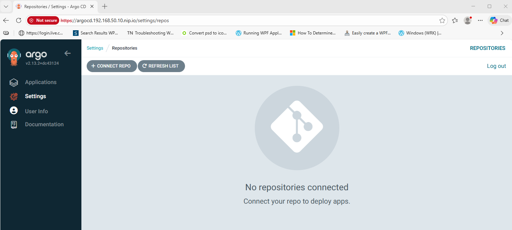
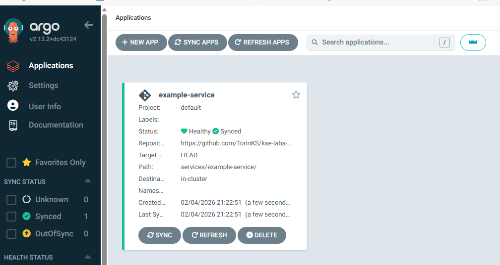

# ArgoCD Configuration Guide

## Overview

ArgoCD is a declarative GitOps continuous delivery tool for Kubernetes. It monitors Git repositories and automatically syncs the desired application state to the cluster.

## Access ArgoCD

### Web UI

**URL**: http://argocd.192.168.50.10.nip.io/applications

### Credentials

| Username | Password |
|----------|----------|
| admin | Run command below to get password |

```bash
# Get ArgoCD admin password
kubectl -n argocd get secret argocd-initial-admin-secret -o jsonpath='{.data.password}' | base64 -d
```

### CLI Login

```bash
# Install ArgoCD CLI (if not installed)
# macOS
brew install argocd

# Linux
curl -sSL -o argocd https://github.com/argoproj/argo-cd/releases/latest/download/argocd-linux-amd64
chmod +x argocd
sudo mv argocd /usr/local/bin/

# Login to ArgoCD
argocd login argocd.192.168.50.10.nip.io --username admin --password $(kubectl -n argocd get secret argocd-initial-admin-secret -o jsonpath='{.data.password}' | base64 -d)
```

## Connect Repository

### Option 1: Web UI

1. Go to **Settings** → **Repositories**
2. Click **Connect Repo**
3. Configure:
   - **Connection method**: via HTTPS
   - **Type**: git
   - **Project**: default
   - **Repository URL**: `https://github.com/TorinKS/kse-labs-deployment.git`



### Option 2: CLI

```bash
# Add repository (public)
argocd repo add https://github.com/TorinKS/kse-labs-deployment.git

# Add repository (private - with credentials)
argocd repo add https://github.com/TorinKS/kse-labs-deployment.git \
  --username <username> \
  --password <token>

# List connected repositories
argocd repo list
```

## Create Application

### Option 1: Web UI

1. Click **+ New App** or go to **Applications** → **New Application**
2. Configure:

| Field | Value |
|-------|-------|
| Application name | example-service |
| Project name | default |
| Sync Policy | Manual (or Automatic) |
| Repository URL | https://github.com/TorinKS/kse-labs-deployment.git |
| Revision | HEAD (or specific branch/tag) |
| Path | services/example-service/ |
| Cluster URL | https://kubernetes.default.svc |
| Namespace | default (or target namespace) |

3. Click **Create**



### Option 2: CLI

```bash
# Create application
argocd app create example-service \
  --repo https://github.com/TorinKS/kse-labs-deployment.git \
  --path services/example-service \
  --dest-server https://kubernetes.default.svc \
  --dest-namespace default \
  --project default

# Create with auto-sync enabled
argocd app create example-service \
  --repo https://github.com/TorinKS/kse-labs-deployment.git \
  --path services/example-service \
  --dest-server https://kubernetes.default.svc \
  --dest-namespace default \
  --project default \
  --sync-policy automated \
  --auto-prune \
  --self-heal
```

### Option 3: Declarative YAML

Create `application.yaml`:

```yaml
apiVersion: argoproj.io/v1alpha1
kind: Application
metadata:
  name: example-service
  namespace: argocd
spec:
  project: default
  source:
    repoURL: https://github.com/TorinKS/kse-labs-deployment.git
    targetRevision: HEAD
    path: services/example-service
  destination:
    server: https://kubernetes.default.svc
    namespace: default
  syncPolicy:
    automated:
      prune: true
      selfHeal: true
```

Apply:

```bash
kubectl apply -f application.yaml
```

## Application Management

### Sync Application

```bash
# Manual sync
argocd app sync example-service

# Sync with prune (remove resources not in Git)
argocd app sync example-service --prune

# Force sync (replace resources)
argocd app sync example-service --force
```

### View Application Status

```bash
# List all applications
argocd app list

# Get application details
argocd app get example-service

# View application history
argocd app history example-service

# View application manifests
argocd app manifests example-service
```

### Delete Application

```bash
# Delete application (keeps deployed resources)
argocd app delete example-service

# Delete application and deployed resources
argocd app delete example-service --cascade
```

## How ArgoCD Works

```
┌─────────────────────────────────────────────────────────────────────┐
│                        Git Repository                                │
│  kse-labs-deployment/services/example-service/                       │
│  ├── deployment.yaml                                                 │
│  └── service.yaml                                                    │
└──────────────────────────────┬──────────────────────────────────────┘
                               │ ArgoCD monitors
                               │ and syncs
                               ▼
┌─────────────────────────────────────────────────────────────────────┐
│                      ArgoCD Controller                               │
│  1. Clones repository                                                │
│  2. Reads manifests from path (YAML, Kustomize, or Helm)            │
│  3. Compares desired state vs actual cluster state                   │
│  4. Applies changes to bring cluster to desired state                │
└──────────────────────────────┬──────────────────────────────────────┘
                               │
                               ▼
┌─────────────────────────────────────────────────────────────────────┐
│                     Kubernetes Cluster                               │
│  Namespace: default                                                  │
│  ├── Deployment: example-service                                     │
│  └── Service: example-service                                        │
└─────────────────────────────────────────────────────────────────────┘
```

**Supported manifest formats:**
- Plain Kubernetes YAML
- Kustomize
- Helm charts
- Jsonnet

## Troubleshooting

### Check ArgoCD pods

```bash
kubectl get pods -n argocd
```

### View ArgoCD logs

```bash
# Application controller logs
kubectl logs -n argocd -l app.kubernetes.io/name=argocd-application-controller

# Server logs
kubectl logs -n argocd -l app.kubernetes.io/name=argocd-server
```

### Application out of sync

```bash
# Check diff between Git and cluster
argocd app diff example-service

# Hard refresh (clear cache)
argocd app get example-service --hard-refresh
```

### Repository connection issues

```bash
# Test repository access
argocd repo get https://github.com/TorinKS/kse-labs-deployment.git

# Remove and re-add repository
argocd repo rm https://github.com/TorinKS/kse-labs-deployment.git
argocd repo add https://github.com/TorinKS/kse-labs-deployment.git
```

## Best Practices

1. **Use separate deployment repository**: Keep Kubernetes manifests in a dedicated repo (like `kse-labs-deployment`)
2. **Enable auto-sync with caution**: Start with manual sync, enable auto-sync once confident
3. **Use application sets**: For managing multiple similar applications
4. **Implement RBAC**: Restrict who can sync/delete applications
5. **Monitor sync status**: Set up alerts for failed syncs
