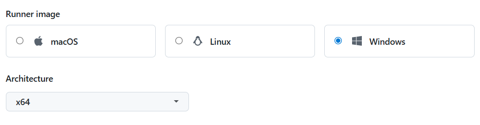
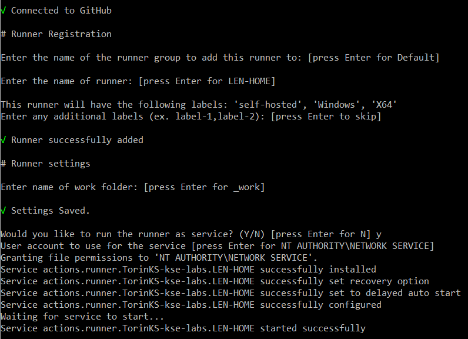

### Configure runner
In you project, go to Settings / Actions / Runners - https://github.com/TorinKS/kse-labs/settings/actions/runners

New self-hosted runner
Select the runner's architecture

and then download and install it.

Just keep all parameters by default

