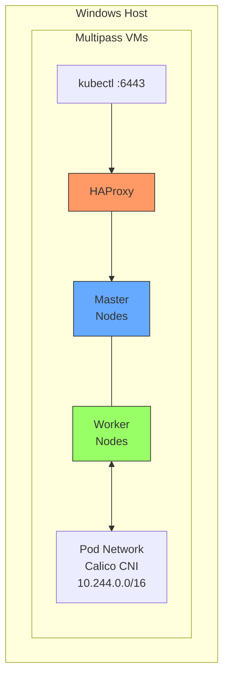

# Local Kubernetes Cluster Documentation

This directory contains documentation for the local Kubernetes cluster infrastructure.

## Documents

| Document | Description |
|----------|-------------|
| [Architecture](architecture.md) | Overall architecture, components, and network topology |
| [Configuration](configuration.md) | How to configure and customize the cluster |
| [How It Works](how-it-works.md) | Detailed explanation of the provisioning process |

## Quick Start

1. Install prerequisites (Multipass, Terraform)
2. Generate SSH keys:
   ```powershell
   ssh-keygen -t rsa -b 4096 -f "$env:USERPROFILE\.ssh\kse_ci_cd_sec_id_rsa" -N ""
   ```
3. Run Terraform:
   ```bash
   cd prepare-local-k8s/scripts/windows
   terraform init
   terraform apply
   ```
4. Access the cluster:
   ```powershell
   $env:KUBECONFIG = "$env:USERPROFILE\.kube\config-multipass"
   kubectl get nodes
   ```

## Architecture Summary



## Default Configuration

| Setting | Default Value |
|---------|--------------|
| Masters | 1 |
| Workers | 3 |
| CPU per VM | 2 |
| Memory per VM | 2G |
| Disk per VM | 10G |
| Kubernetes | 1.32.11 |
| CNI | Calico 3.31.3 |
