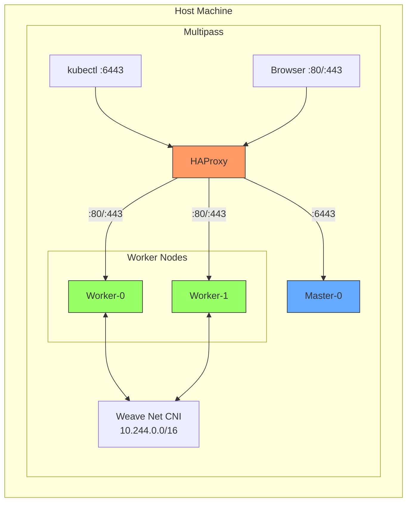
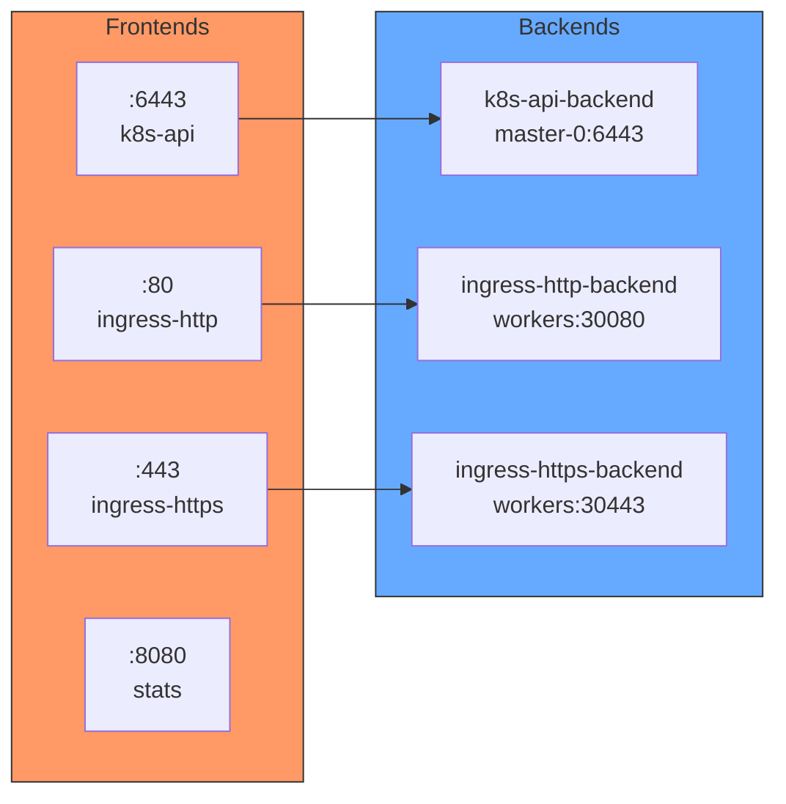
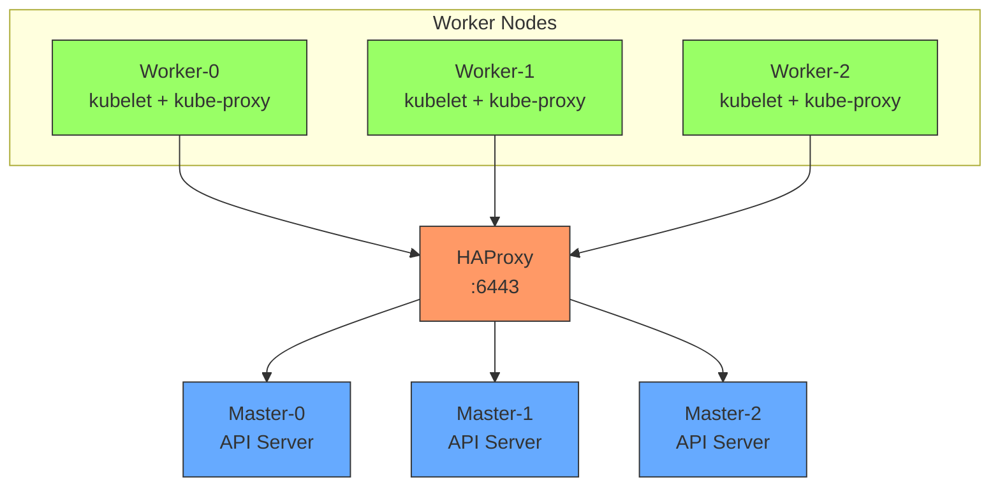
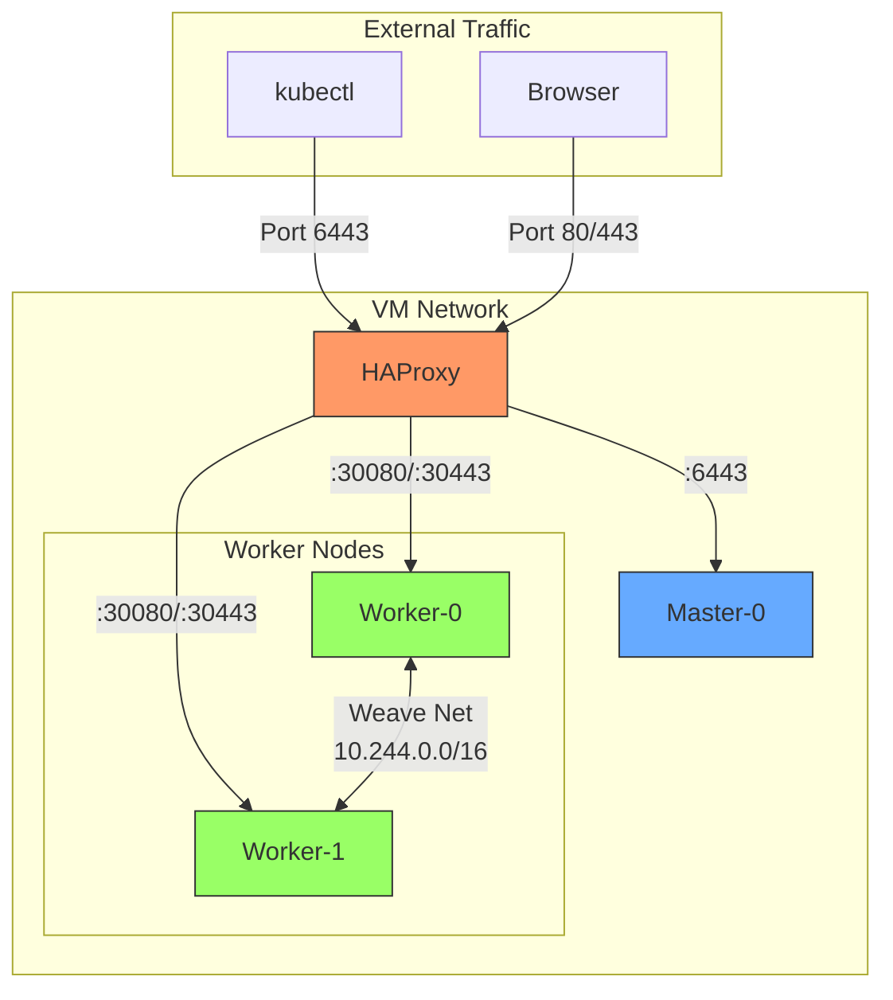
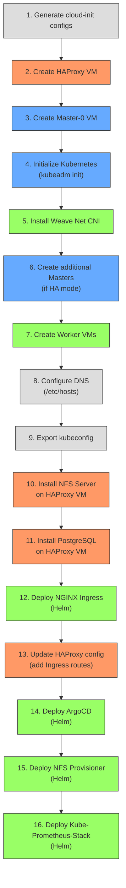
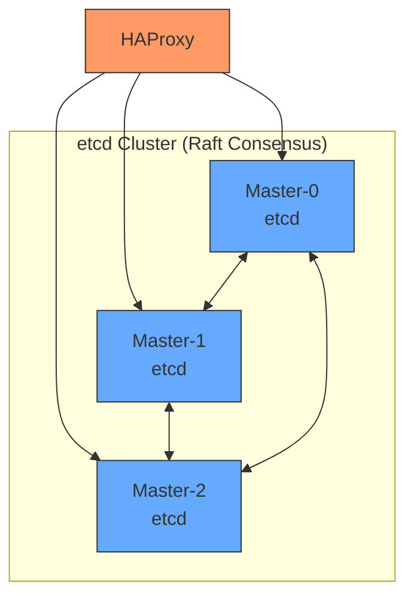

# Local Kubernetes Cluster Architecture

This document describes the architecture of the local Kubernetes cluster provisioned using Terraform and Multipass.

## Overview

The infrastructure creates a production-like Kubernetes cluster on your local machine using Multipass VMs. The architecture supports High Availability (HA) configurations with multiple control plane nodes.

> **Note on IP addresses**: This document uses Windows static IPs (`192.168.50.x`) as examples. On macOS, IPs are dynamically assigned by Multipass (typically `192.168.64.x`). Run `multipass list` to find your actual IPs.



> **Note**: The diagram shows the default configuration (1 master, 2 workers). For HA mode, set `masters >= 3` to add additional control plane nodes.

## Components

### 1. HAProxy Load Balancer

**Purpose**: Provides a stable endpoint for the Kubernetes API server and Ingress traffic.

- **VM Name**: `haproxy`
- **IP Address**: Windows: `192.168.50.10` (static), macOS: dynamically assigned
- **Ports**:
  - 6443: Kubernetes API (TCP passthrough to masters)
  - 80: HTTP Ingress (TCP to workers:30080)
  - 443: HTTPS Ingress (TCP to workers:30443)
  - 8080: HAProxy Stats Dashboard
- **Backend**: Routes traffic to control plane nodes and worker nodes
- **Health Checks**: Monitors master and worker node availability

The HAProxy VM serves as the control plane endpoint (`--control-plane-endpoint` in kubeadm), which is essential for:
- **High Availability**: If one master fails, HAProxy routes to healthy masters
- **Stable Endpoint**: The kubeconfig points to HAProxy's IP, not individual masters
- **Future Scaling**: Adding more masters doesn't require kubeconfig changes
- **Certificate Generation**: Certificates include HAProxy's IP in Subject Alternative Names (SANs)

#### HAProxy Configuration Templates

The HAProxy configuration is managed by two Terraform templates:

1. **Initial config** (`haproxy.cfg.tpl`): Used during cluster bootstrap, only exposes K8s API
2. **Ingress config** (`haproxy-ingress.cfg.tpl`): Applied after NGINX Ingress is installed, adds HTTP/HTTPS routing

```
scripts/windows/script/haproxy.cfg.tpl          # Initial (API only)
scripts/windows/script/haproxy-ingress.cfg.tpl  # Final (API + Ingress)
```

**Configuration Structure (after Ingress installation):**



**Key Configuration Sections:**

| Section | Purpose |
|---------|---------|
| `global` | Process-wide settings: max connections (2048), logging, security (chroot, user/group) |
| `defaults` | Default timeouts and logging options (TCP mode) |
| `frontend stats` | Stats dashboard on port 8080 with basic auth |
| `frontend k8s-api` | Kubernetes API on port 6443 (TCP passthrough) |
| `frontend ingress-http` | HTTP traffic on port 80 to worker NodePorts |
| `frontend ingress-https` | HTTPS traffic on port 443 to worker NodePorts |

**Template Variables:**

The template uses Terraform interpolation to dynamically add master and worker nodes:

```hcl
# Master nodes for K8s API
server master-0 ${master-0}:6443 check
%{ if master-1 != "" }  server master-1 ${master-1}:6443 check
%{ endif ~}
%{ if master-2 != "" }  server master-2 ${master-2}:6443 check
%{ endif ~}

# Worker nodes for Ingress (dynamically generated)
%{ for idx, ip in workers ~}
  server worker-${idx} ${ip}:30080 check
%{ endfor ~}
```

This ensures:
- `master-0` is always present
- `master-1` and `master-2` are added only in HA mode (when `masters >= 3`)
- All worker nodes are added to ingress backends automatically

**Stats Dashboard:**

HAProxy provides a statistics dashboard:
- **URL**: `http://<HAPROXY_IP>:8080/stats`
- **Username**: `hapuser`
- **Password**: `password!1234`

**TCP Mode Explained:**

All frontends use `mode tcp` (Layer 4) instead of `mode http` (Layer 7) because:
- Kubernetes API uses TLS encryption
- NGINX Ingress Controller handles TLS termination for web traffic
- HAProxy passes through encrypted traffic without terminating TLS
- The API server and Ingress handle their own certificates

#### Why `--control-plane-endpoint` is Required

When `kubeadm init` runs, it generates certificates and kubeconfig files. Without `--control-plane-endpoint`:
- Certificates would be bound to the master node's IP only
- The kubeconfig would point directly to `master-0:6443`
- Adding more masters later would require certificate regeneration

With `--control-plane-endpoint $HAPROXY_IP:6443`:
- All components (kubectl, kubelets, kube-proxy) connect through HAProxy
- The cluster is HA-ready from day one, even with a single master
- Masters can be added/removed without changing client configurations

#### All Components Use HAProxy

**Not just kubectl** - all cluster components communicate with the API server through HAProxy:



**What workers send to the API server through HAProxy:**

| Communication | Purpose |
|--------------|---------|
| Node registration | Register itself as a cluster node |
| Pod specs | Get pods scheduled to this node |
| Status updates | Report node/pod health |
| Watch events | Listen for pod create/delete/update |
| Lease renewals | Heartbeat to prove node is alive |

You can verify this on any worker node:
```bash
cat /etc/kubernetes/kubelet.conf | grep server
# Output: server: https://<haproxy-ip>:6443
```

> **Important**: HAProxy is a critical component - if it goes down, workers lose contact with the control plane and cannot receive new workloads or report status.

### 2. Control Plane Nodes (Masters)

**Purpose**: Run Kubernetes control plane components.

Each master node runs:
- **kube-apiserver**: API server for cluster management
- **kube-controller-manager**: Manages controllers (replication, endpoints, etc.)
- **kube-scheduler**: Schedules pods to worker nodes
- **etcd**: Distributed key-value store for cluster state

Default configuration:
- **Count**: 1 (configurable up to 3+ for HA)
- **VM Prefix**: `master-N`

### 3. Worker Nodes

**Purpose**: Run application workloads (pods).

Each worker node runs:
- **kubelet**: Node agent that manages pods
- **kube-proxy**: Network proxy for service routing
- **Container Runtime**: Docker with cri-dockerd

Default configuration:
- **Count**: 2
- **VM Prefix**: `worker-N`
- **IP Range**: Windows: `192.168.50.21+` (configurable), macOS: dynamically assigned

### 4. Container Runtime

The cluster uses **Docker** with **cri-dockerd** as the Container Runtime Interface (CRI).

- Docker is installed via apt
- cri-dockerd is compiled from source (requires Go)
- Socket: `unix:///var/run/cri-dockerd.sock`

### 5. Pod Network (CNI)

**Weave Net** is used as the Container Network Interface (CNI) plugin.

- **Version**: 2.8.1
- **Pod CIDR**: 10.244.0.0/16
- **Features**: Simple setup, mesh networking, automatic IP allocation

### 6. Pre-installed Applications

The cluster comes with several pre-installed applications (deployed via Terraform Helm provider):

| Application | Version | Purpose | Access URL |
|-------------|---------|---------|------------|
| **ArgoCD** | 7.7.10 | GitOps continuous delivery | http://argocd.\<HAPROXY_IP\>.nip.io |
| **Kube-Prometheus-Stack** | 80.14.0 | Monitoring suite | - |
| **Grafana** | (bundled) | Metrics visualization | http://grafana.\<HAPROXY_IP\>.nip.io |
| **Prometheus** | (bundled) | Metrics collection | http://prometheus.\<HAPROXY_IP\>.nip.io |
| **AlertManager** | (bundled) | Alert management | http://alertmanager.\<HAPROXY_IP\>.nip.io |
| **NGINX Ingress** | 4.12.0 | Ingress controller | NodePorts: 30080/30443 |
| **NFS Provisioner** | 4.0.18 | Dynamic PV provisioning | StorageClass: `nfs-client` |
| **PostgreSQL** | Latest | External database | \<HAPROXY_IP\>:5432 |

**Default Credentials:**
- **ArgoCD**: admin / `kubectl -n argocd get secret argocd-initial-admin-secret -o jsonpath='{.data.password}' | base64 -d`
- **Grafana**: admin / admin
- **PostgreSQL**: postgres / `multipass exec haproxy -- cat /root/postgres_credentials.txt`

### 7. Storage Architecture

The HAProxy VM also serves as the NFS server for persistent storage:

```
HAProxy VM (<HAPROXY_IP>)
├── HAProxy Load Balancer (:6443, :80, :443)
├── NFS Server (/srv/nfs/k8s-storage)
└── PostgreSQL Database (:5432)
```

The NFS Subdir External Provisioner creates subdirectories for each PVC:
- StorageClass: `nfs-client` (default)
- Reclaim Policy: Delete
- Access Modes: ReadWriteMany

## VM Specifications

| Component | Count | Default CPU | Default Memory | Default Disk | Windows IP | macOS IP |
|-----------|-------|-------------|----------------|--------------|------------|----------|
| HAProxy   | 1     | 2           | 4G             | 30G          | 192.168.50.10 | Dynamic |
| Master    | 1     | 2           | 4G             | 10G          | 192.168.50.11 | Dynamic |
| Worker    | 2     | 3           | 3G             | 15G          | 192.168.50.21-22 | Dynamic |

**Total resources (default config):** 10 vCPUs, 14G RAM, 70G disk

## Network Architecture



**Network Summary:**
- **VM Network**: Windows: `192.168.50.0/24` (Hyper-V internal switch), macOS: dynamically assigned by Multipass
- **Pod Network**: 10.244.0.0/16 (Weave Net CNI)
- **Service Network**: 10.96.0.0/12 (default Kubernetes)

## Provisioning Order

Terraform provisions resources in the following order:



## High Availability Mode

When `masters >= 3`, the cluster operates in HA mode:

- Multiple etcd instances with leader election
- HAProxy distributes API requests across all masters
- Certificate upload for seamless master joining
- Automatic failover if a master becomes unavailable



## Security Considerations

- SSH access uses key-based authentication only
- HAProxy stats page has basic auth protection
- kubeadm generates certificates with proper SANs
- Root access is required for Terraform provisioners
- HAProxy uses secure SSL/TLS settings (no SSLv3, TLSv1.0, TLSv1.1)
