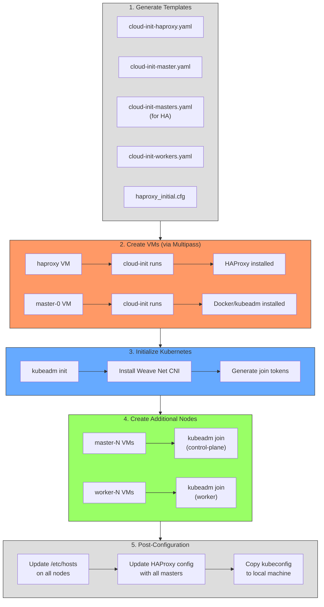
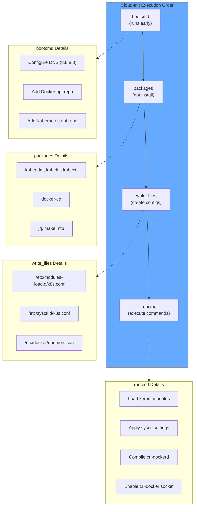
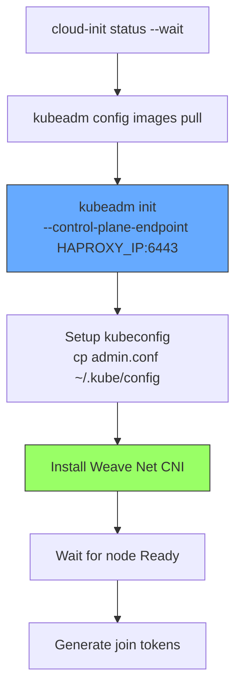
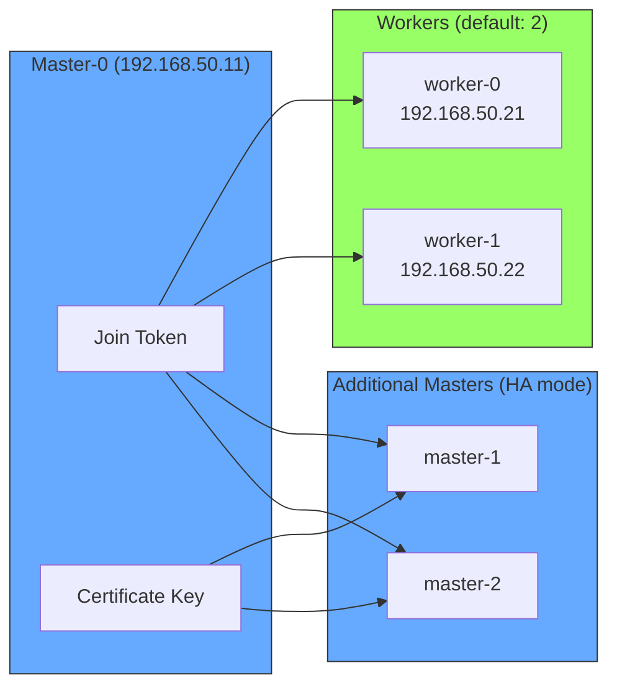
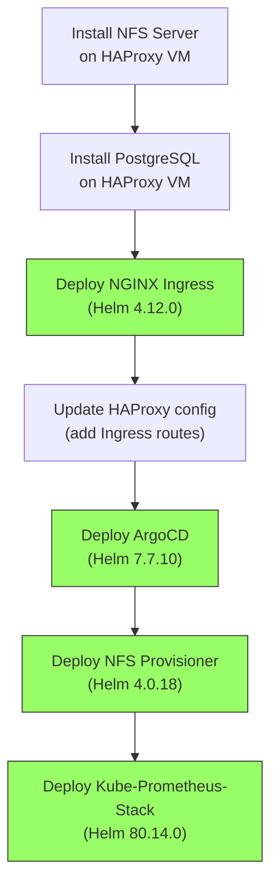
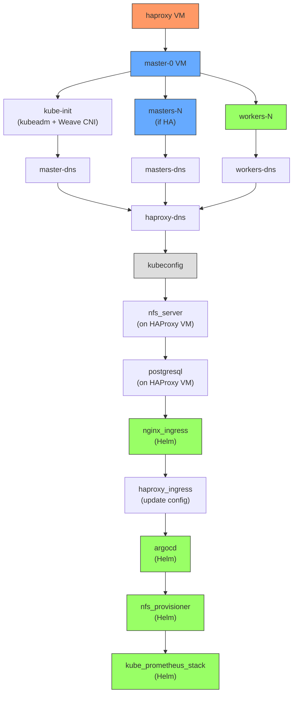

# How It Works

This document provides a detailed explanation of the provisioning process.

## Overview

The infrastructure is provisioned using:
- **Terraform** - Infrastructure as Code (IaC) tool
- **Multipass** - Lightweight VM manager (uses Hyper-V on Windows)
- **cloud-init** - VM initialization and configuration
- **kubeadm** - Kubernetes cluster bootstrapping

## Provisioning Flow



## Detailed Steps

### Step 1: Template Generation

Terraform generates cloud-init YAML files using the `templatefile()` function.

**template.tf** creates:
- Injects SSH public key into cloud-init configs
- Sets Kubernetes version
- Configures HAProxy IP for control plane endpoint

### Step 2: VM Creation

VMs are created using Multipass via PowerShell scripts.

**multipass.ps1** handles:
```powershell
multipass launch --name <vm-name> \
  --cpus <cpu> \
  --memory <mem> \
  --disk <disk> \
  --cloud-init <cloud-init.yaml>
```

The `data.external` resources fetch VM IP addresses using:
```powershell
multipass info <vm-name> --format json | ConvertFrom-Json
```

### Step 3: Cloud-Init Execution

When each VM boots, cloud-init executes the configuration:



**For Kubernetes Nodes (cloud-init.yaml):**

1. **bootcmd** (runs early, before networking):
   - Configure DNS (8.8.8.8)
   - Add Docker and Kubernetes apt repositories

2. **packages** (install via apt):
   - kubeadm, kubelet, kubectl
   - docker-ce
   - Required utilities (jq, make, ntp)

3. **write_files** (create config files):
   - `/etc/modules-load.d/k8s.conf` - Kernel modules
   - `/etc/sysctl.d/k8s.conf` - Sysctl settings
   - `/etc/docker/daemon.json` - Docker configuration

4. **runcmd** (execute commands):
   - Load kernel modules (br_netfilter, overlay, ip_vs, etc.)
   - Apply sysctl settings
   - Download and compile cri-dockerd
   - Enable cri-docker socket

**For HAProxy (cloud-init-haproxy.yaml):**
- Install haproxy package
- Configure root SSH access

### Step 4: Kubernetes Initialization

After cloud-init completes, Terraform runs **kube-init.sh** on master-0:



```bash
# 1. Wait for cloud-init
cloud-init status --wait

# 2. Pull container images
kubeadm config images pull --cri-socket unix:///var/run/cri-dockerd.sock

# 3. Initialize cluster
kubeadm init \
  --upload-certs \
  --pod-network-cidr 10.244.0.0/16 \
  --apiserver-advertise-address $LOCAL_IP \
  --control-plane-endpoint $HAPROXY_IP:6443 \
  --cri-socket unix:///var/run/cri-dockerd.sock

# 4. Setup kubeconfig
mkdir -p $HOME/.kube
cp /etc/kubernetes/admin.conf $HOME/.kube/config

# 5. Install Weave Net CNI
kubectl apply -f https://github.com/weaveworks/weave/releases/download/v2.8.1/weave-daemonset-k8s.yaml

# 6. Generate join tokens
kubeadm token create --print-join-command > /etc/join.json
```

### Step 5: Node Joining



**Workers** join using the token from master-0:
```bash
kubeadm join <haproxy-ip>:6443 \
  --token <token> \
  --discovery-token-ca-cert-hash <hash> \
  --cri-socket unix:///var/run/cri-dockerd.sock
```

**Additional Masters** join with the certificate key:
```bash
kubeadm join <haproxy-ip>:6443 \
  --token <token> \
  --discovery-token-ca-cert-hash <hash> \
  --control-plane \
  --certificate-key <cert-key> \
  --cri-socket unix:///var/run/cri-dockerd.sock
```

### Step 6: DNS Configuration

After all nodes are created, Terraform updates `/etc/hosts` on every node:

```
<haproxy-ip>  haproxy
<master-0-ip> master-0
<master-1-ip> master-1
<worker-0-ip> worker-0
...
```

This allows nodes to resolve each other by hostname.

### Step 7: HAProxy Final Configuration

The HAProxy configuration is updated in two phases:

**Initial config** (during bootstrap): Only Kubernetes API routing
```
frontend k8s-api
  bind :6443
  mode tcp
  default_backend k8s-api-backend

backend k8s-api-backend
  mode tcp
  server master-0 <master-0-ip>:6443 check
  server master-1 <master-1-ip>:6443 check  # if HA mode
  server master-2 <master-2-ip>:6443 check  # if HA mode
```

**Final config** (after NGINX Ingress is installed): Adds HTTP/HTTPS routing to workers
```
frontend ingress-http
  bind :80
  mode tcp
  default_backend ingress-http-backend

backend ingress-http-backend
  mode tcp
  server worker-0 <worker-0-ip>:30080 check
  server worker-1 <worker-1-ip>:30080 check

frontend ingress-https
  bind :443
  mode tcp
  default_backend ingress-https-backend

backend ingress-https-backend
  mode tcp
  server worker-0 <worker-0-ip>:30443 check
  server worker-1 <worker-1-ip>:30443 check
```

### Step 8: Kubeconfig Export

The kubeconfig is copied to the local machine:

```powershell
scp -o StrictHostKeyChecking=no -o UserKnownHostsFile=NUL \
  root@<master-0-ip>:/etc/kubernetes/admin.conf ~/.kube/config-multipass
Copy-Item ~/.kube/config-multipass ~/.kube/config
```

The `server:` URL in the kubeconfig points to the HAProxy IP (192.168.50.10:6443).

### Step 9: Helm Releases Installation

After the cluster is ready, Terraform deploys applications via Helm:



**Applications deployed:**
| Application | Helm Chart Version | Namespace |
|-------------|-------------------|-----------|
| NGINX Ingress | 4.12.0 | ingress-nginx |
| ArgoCD | 7.7.10 | argocd |
| NFS Provisioner | 4.0.18 | nfs-provisioner |
| Kube-Prometheus-Stack | 80.14.0 | monitoring |

## Terraform Resources

| Resource Type | Purpose |
|--------------|---------|
| `local_file` | Generate cloud-init and haproxy configs |
| `data.external` | Fetch VM IPs via PowerShell |
| `null_resource` | Execute provisioners (SSH, scripts) |
| `helm_release` | Deploy Kubernetes applications |
| `kubernetes_ingress_v1` | Create Ingress resources for applications |

## Key Files

| File | Purpose |
|------|---------|
| `variables.tf` | Input variables and locals |
| `template.tf` | Template file generation |
| `haproxy.tf` | HAProxy VM provisioning |
| `master.tf` | First master node provisioning |
| `more_masters.tf` | Additional master nodes (HA) |
| `workers.tf` | Worker nodes provisioning |
| `dns.tf` | /etc/hosts configuration |
| `kube_config.tf` | Export kubeconfig locally |
| `data.tf` | External data sources for join tokens |
| `ingress.tf` | NGINX Ingress Controller + HAProxy Ingress config |
| `argocd.tf` | ArgoCD deployment |
| `storage.tf` | NFS server, PostgreSQL, NFS Provisioner |
| `monitoring.tf` | Kube-Prometheus-Stack (Prometheus, Grafana, AlertManager) |

## Timing and Dependencies



The `depends_on` relationships ensure proper ordering during provisioning.
