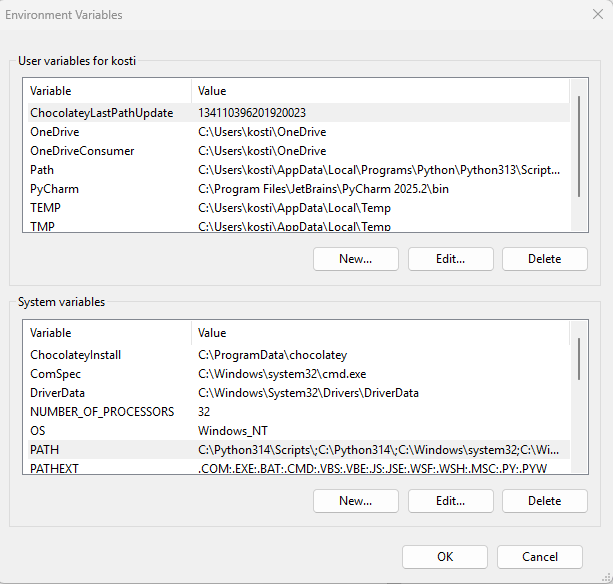

### Why Terraform + multipass for local k8s cluster
There are different alternatives:
- minikube
- kind
- ...

But we would like to have k8s nodes on VM that give you flexibility:
- you can install additional software to the nodes (postgresql, harbor, etc)
- Full control over networking with static IPs
- Production-like environment with HAProxy load balancer
- Pre-installed monitoring, GitOps, and storage solutions

### Cost Comparison: Local vs AWS 

Running a similar Kubernetes cluster on AWS would cost significantly more:

| Component | Local (This Setup) | AWS Equivalent | AWS Monthly Cost |
|-----------|-------------------|----------------|------------------|
| **Control Plane** | 1 master (4G RAM, 2 vCPU) | EKS Control Plane | ~$73/month |
| **Worker Nodes** | 2x workers (3G RAM, 3 vCPU) | 2x t3.medium EC2 | ~$60/month |
| **Load Balancer** | HAProxy VM | ALB/NLB | ~$20/month |
| **Storage** | NFS on HAProxy (30G) | EBS gp3 (30G) | ~$3/month |
| **Database** | PostgreSQL on HAProxy | RDS db.t3.micro | ~$15/month |
| **Monitoring** | Prometheus/Grafana | CloudWatch + Managed Grafana | ~$30/month |
| **Total** | **$0/month*** | - | **~$200/month** |

*\*Excluding electricity and hardware depreciation costs*

**Additional AWS costs not included:**
- Data transfer costs (~$0.09/GB outbound)
- NAT Gateway (~$32/month + data processing)
- Route53 hosted zone (~$0.50/month)
- Secrets Manager (~$0.40/secret/month)

**AWS Free Tier limitations:**

While AWS offers a Free Tier, it has significant limitations for Kubernetes workloads:
- Default vCPU quotas are restrictive and difficult to change (requires support tickets)
- Default EC2 instance quotas don't provide enough capacity to run even basic applications like ArgoCD in EKS
- Memory limitations on free tier instances (t2.micro: 1GB RAM) are insufficient for Kubernetes workloads
- EKS control plane is NOT included in Free Tier (~$73/month regardless)
- Quota increase requests can take days to process

> **Note**: In a later lecture, we will deep dive into IaC security and explore how to provision infrastructure in the cloud and analyze the real costs involved.

**Benefits of local setup for learning:**
- Zero cloud costs for experimentation
- Instant provisioning (no waiting for cloud resources)
- Full root access to all VMs
- No cloud account/billing setup required
- No quota limitations or approval processes
- Safe environment for destructive testing
- Works offline (after initial image download)


### Terraform installation
#### Windows

##### Prerequisites
1. Install Multipass utility for Windows from https://multipass.run/install
2. Install Terraform from https://developer.hashicorp.com/terraform/install

Go to https://developer.hashicorp.com/terraform/install download zip archive with one terraform executable file. And put it to the directory which is included to %PATH% variable, like to %WINDIR% Or put it to any directory you like and add this directory to the PATH env.
Edit system properties / Advanced / Environment variables / System variables / PATH



##### Generate SSH keys

Generate SSH keys in the standard Windows location (`$env:USERPROFILE\.ssh`):

```bash
ssh-keygen -t rsa -b 4096 -f "$HOME/.ssh/kse_ci_cd_sec_id_rsa" -N "" -q
```

Or using PowerShell:
```powershell
ssh-keygen -t rsa -b 4096 -f "$env:USERPROFILE\.ssh\kse_ci_cd_sec_id_rsa" -N ""
```

Verify that they were successfully generated:
```powershell
Get-ChildItem $env:USERPROFILE\.ssh
```

You should see:
- `kse_ci_cd_sec_id_rsa` (private key)
- `kse_ci_cd_sec_id_rsa.pub` (public key)

##### Run Terraform

Navigate to the Windows scripts directory and run:

```bash
cd prepare-local-k8s/scripts/windows
terraform init
terraform apply
```

##### Configuration Variables

You can customize the cluster by setting Terraform variables:

| Variable | Default | Description |
|----------|---------|-------------|
| `cpu` | 2 | Number of CPUs per VM |
| `mem` | 2G | Memory per VM (default) |
| `master_mem` | 4G | Memory for master nodes |
| `haproxy_mem` | 4G | Memory for HAProxy VM |
| `worker_mem` | 3G | Memory for worker nodes |
| `disk` | 10G | Disk size per VM (default) |
| `haproxy_disk` | 30G | Disk size for HAProxy (includes NFS storage) |
| `worker_disk` | 15G | Disk size for worker nodes |
| `worker_cpu` | 3 | Number of CPUs for worker nodes |
| `masters` | 1 | Number of control plane nodes |
| `workers` | 2 | Number of worker nodes |
| `kube_version` | 1.32.11-1.1 | Kubernetes version |
| `kube_minor_version` | 1.32 | Kubernetes minor version for apt repository |
| `ssh_key_name` | kse_ci_cd_sec_id_rsa | SSH key name (without extension) in USERPROFILE\.ssh |
| `ubuntu_image` | 22.04 | Ubuntu image version for VMs |

Example with custom values:
```bash
terraform apply -var="workers=2" -var="master_mem=6G"
```

##### What Gets Installed

The cluster comes with the following pre-installed applications:

| Application | Version | URL | Credentials |
|-------------|---------|-----|-------------|
| **ArgoCD** | 7.7.10 | http://argocd.192.168.50.10.nip.io | admin / (run: `kubectl -n argocd get secret argocd-initial-admin-secret -o jsonpath='{.data.password}' \| base64 -d`) |
| **Harbor** | 1.18.1 | http://harbor.192.168.50.10.nip.io | admin / (run: `terraform output -raw harbor_admin_password`) |
| **Dependency-Track** | 0.41.0 | http://dtrack.192.168.50.10.nip.io | admin / admin (change on first login) |
| **Kube-Prometheus-Stack** | 80.14.0 | - | Includes Prometheus, Grafana, AlertManager |
| **Grafana** | (bundled) | http://grafana.192.168.50.10.nip.io | admin / admin |
| **Prometheus** | (bundled) | http://prometheus.192.168.50.10.nip.io | - |
| **AlertManager** | (bundled) | http://alertmanager.192.168.50.10.nip.io | - |
| **NGINX Ingress** | 4.12.0 | - | NodePorts: 30080 (HTTP), 30443 (HTTPS) |
| **NFS Provisioner** | 4.0.18 | - | StorageClass: `nfs-client` (default) |
| **PostgreSQL** | Latest | 192.168.50.10:5432 | postgres / (run: `multipass exec haproxy -- cat /root/postgres_credentials.txt`) |
| **Weave Net CNI** | 2.8.1 | - | Pod CIDR: 10.244.0.0/16 |

##### Network Configuration

The cluster uses static IPs on a dedicated Hyper-V switch (192.168.50.0/24):

| VM | IP Address | Resources | Purpose |
|----|------------|-----------|---------|
| haproxy | 192.168.50.10 | 2 CPU, 4G RAM, 30G disk | Load balancer, NFS server, PostgreSQL |
| master-0 | 192.168.50.11 | 2 CPU, 4G RAM, 10G disk | Kubernetes control plane |
| worker-0 | 192.168.50.21 | 3 CPU, 3G RAM, 15G disk | Kubernetes worker node |
| worker-1 | 192.168.50.22 | 3 CPU, 3G RAM, 15G disk | Kubernetes worker node |

**Total resources:** 10 vCPUs, 14G RAM, 70G disk

##### Cleanup

To destroy the cluster and clean up:
```powershell
.\reset.ps1
```
